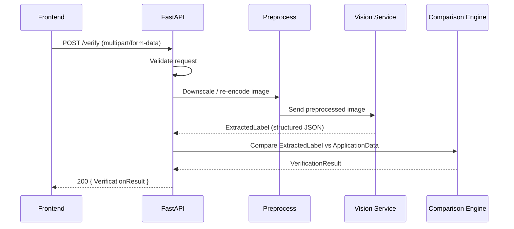
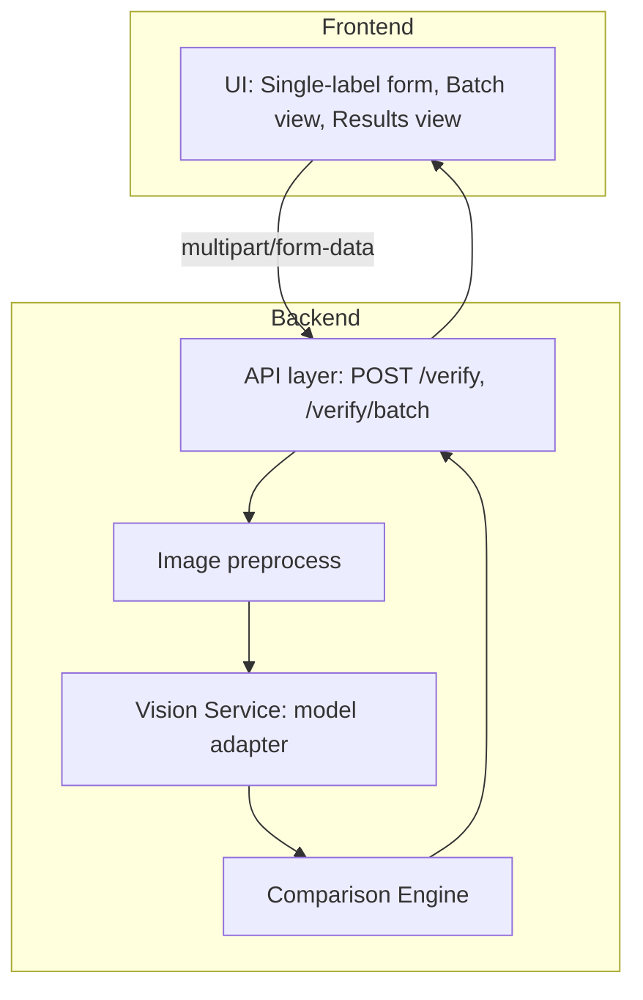

# Architecture

## System Overview

A thin web frontend collects an image plus structured application data and posts it to a stateless FastAPI backend. The backend validates input, preprocesses the image, calls a vision model for structured extraction, then runs the comparison engine field-by-field and returns per-field PASS/FAIL plus an overall verdict. No database — each request is self-contained.

> **Principles**: stateless, isolated components, testable comparison logic, environment-only secrets, under-5-second SLA for single-label verification.

## High-level Request Flow

## System Architecture (Blocks)

## Components & Responsibilities

Component | Responsibility | Why isolated
---|---:|---
Comparison Engine | Field-by-field match logic (fuzzy / normalized / exact) | Pure functions, zero I/O → fully unit-testable without the model
Vision Service | Image → structured `ExtractedLabel` via the vision model | Slow, nondeterministic; isolate so it can be mocked in tests
API layer | HTTP, validation, orchestration, error shaping | Thin; delegates to services above
Image Preprocess | Downscale / re-encode before model call | Directly serves the 5-second budget and cost control
Frontend | Upload, form, results, batch summary | Built against a stable API contract
Config / secrets | API keys via environment variables only | Hard requirement; no keys committed

## Data Model (Pydantic summaries)

These models are the contract between frontend, API, Vision Service and Comparison Engine. Include full `pydantic` definitions in code; this doc summarizes fields and intent.

- `ApplicationData` (input from user):
  - `brand_name: str`
  - `class_type: str`
  - `abv: str` (user-entered string like "45%" or "45")
  - `net_contents: str` (e.g. "750 mL")
  - `producer: str`
  - `country_of_origin: str`
  - `government_warning: str`

- `ExtractedLabel` (vision model output):
  - Same seven fields as above (nullable)
  - `raw_text: str` (full OCRed text)
  - `extraction_confidence: float` (0.0–1.0)

- `FieldResult`:
  - `field: str`
  - `match_type: str` (e.g., "fuzzy", "exact", "numeric", "unit-normalized")
  - `expected: Optional[str]`
  - `found: Optional[str]`
  - `status: "PASS" | "FAIL"`
  - `reason_code: Optional[str]` (machine-readable reason for failures, e.g. `MISSING_FIELD`, `MODEL_TIMEOUT`, `PARSE_ERROR`, `BELOW_THRESHOLD`)

- `VerificationResult`:
  - `results: list[FieldResult]`
  - `overall_verdict: "APPROVED" | "NEEDS_REVIEW"`
  - `latency_ms: int`

- `BatchResult`:
  - `items: list[VerificationResult]`
  - `summary: {passed: int, needs_review: int, total: int}`

**Verdict rule**: any field `FAIL` ⇒ `NEEDS_REVIEW`; all `PASS` ⇒ `APPROVED`.

## Comparison Strategy (Concrete rules)

Field | Strategy | Concrete rules
---|---|---
Brand Name, Class/Type, Producer | Fuzzy | Normalize: lowercase, remove punctuation, collapse whitespace. Use fuzzy ratio ≥ 90 for PASS. Token-aware comparison for short names.
Country of Origin | Normalize + synonyms | Normalize aliases (USA, U.S.A., United States → `United States`) before fuzzy; then apply fuzzy ratio ≥ 95.
Alcohol Content (ABV) | Numeric normalize | Extract numeric value as float percentage. Compare absolute difference ≤ 0.1 (e.g., 45.0 ± 0.1). Accept formats like `45%`, `45`, `45.0% Alc./Vol.`
Net Contents | Unit normalize | Parse quantity and unit; convert canonical unit mL. Compare numeric equality with tolerance of ±1 mL for formatting/OCR noise.
Government Warning | EXACT after whitespace collapse | Collapse consecutive whitespace only; preserve case and punctuation; no fuzzy matching. Compare the normalized warning text against the canonical statement after applying the same whitespace collapse. On `FAIL`, always return extracted warning text for human override.

Design note: thresholds are intentionally conservative; keep them configurable via environment or config file.

## Error Handling & Edge Cases

- **Validation (API layer)**: file MIME/type and size checks; required fields → return `422 Unprocessable Entity` with structured errors.
- **Image Preprocess**: corrupted or too-large images should be rejected or gracefully downsampled. If preprocess fails, return `400` with guidance.
- **Vision Service**: model timeout must still keep the single-label request under the 5-second SLA. Return `200` with a normal `VerificationResult`: affected fields `FAIL`, `overall_verdict: NEEDS_REVIEW`, `reason_code: MODEL_TIMEOUT`, nullable extracted fields, and `extraction_confidence: 0.0`. Do not use `504` for expected model timeouts in the verification flow.
- **Comparison Engine**: missing `ExtractedLabel` fields are treated per-strategy: numeric/unit fields try to parse; fuzzy fields with null produce `FAIL` (and thus `NEEDS_REVIEW`). Record reason codes for each `FAIL`.
- **Batch processing**: per-item failures must not abort whole batch; return item-level `VerificationResult` with `overall_verdict` and include batch-level summary counts.
- **Timeout & SLA**: measure end-to-end latency (`latency_ms`). If latency exceeds SLA, return response but set header `X-Verification-Latency-ms` and log a metric.

| Component | Failure Mode | API Response | Recoverable? |
|---|---|---|---|
| API layer | Missing field | 422 | No (client fix) |
| Vision Service | Timeout / low confidence | 200 VerificationResult with field-level FAIL reason codes | Maybe (retry or manual review) |
| Comparison Engine | Parse error | Field-level FAIL, NEEDS_REVIEW | Yes (manual override) |

## Deployment & Configuration

- **Secrets**: All API keys, model endpoints, and credentials MUST be environment variables. Never commit keys.
- **Config vars**: fuzzy thresholds, model timeout, max image size, worker concurrency. Prefer a small env-based `CONFIG` or 12-factor env vars.
- **Hosting**: backend: FastAPI (Python 3.12) deployed to Render. Frontend: static hosting on Vercel with CDN delivery.
- **Scaling**: stateless design supports horizontal scaling; Render and Vercel both support fast deploys and environment-only secrets for their respective layers.
- **Monitoring**: metrics for latency, extraction_confidence distributions, error rates. Log requests minimally (no PII) and capture `raw_text` only when needed for debugging with retention policy.

## Constraints & Design Decisions

- Hard constraints from project rules:
  - Single-label result in UNDER 5 SECONDS.
  - UI usable by a non-technical 70+ user with no instructions.
  - BATCH UPLOAD required.
  - Government warning: exact, case-sensitive match.
  - API keys in env vars only.
- No database: simplifies stateless scaling and reduces cost/operational burden.
- Isolate Comparison Engine so it can be TDD-first, without model dependency.

## Future Considerations

- Add confidence-based automated routing (if extraction_confidence < X% → manual review).
- Consider caching identical images' extracted labels if repeated uploads expected.
- Add an audit log for legal/compliance needs (append-only, retention policy).

---

See `IMPLEMENTATION.md` for the Build Order and phase-by-phase execution plan.

